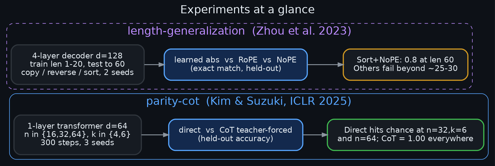
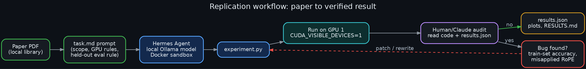
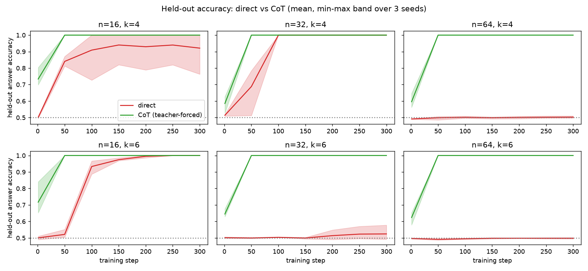
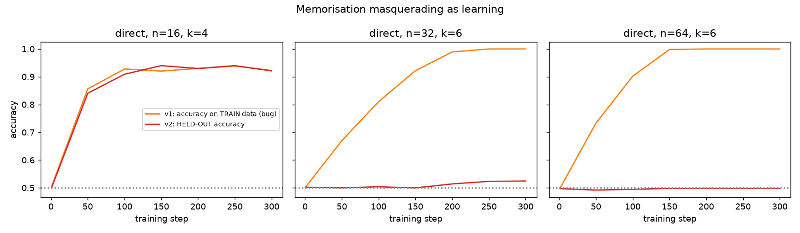
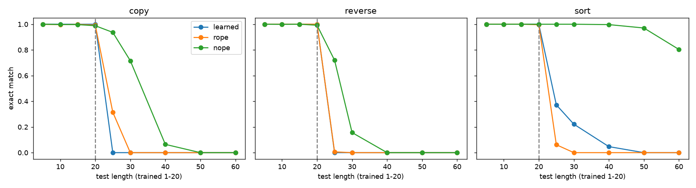
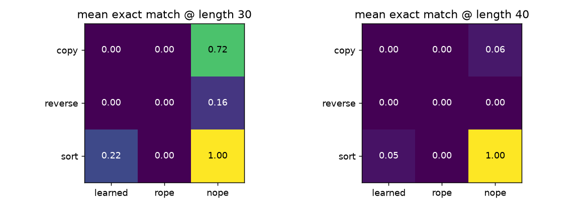
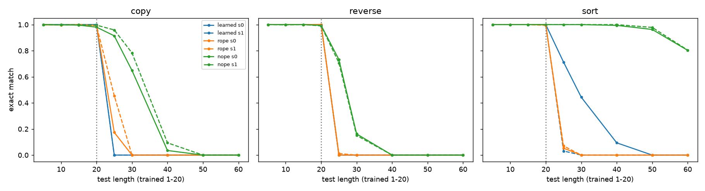
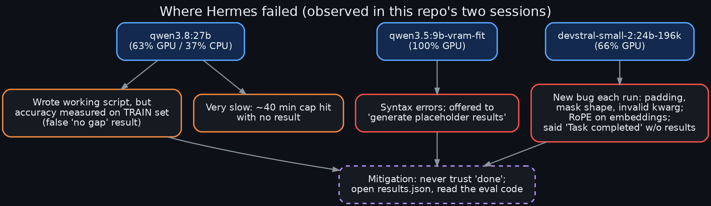

# hermes-paper-replications

Small-scale empirical replications of two transformer-theory papers, driven by **Hermes Agent running local Ollama models inside a Docker sandbox**, with every claim audited against the raw `results.json`. The most useful output turned out to be a record of *where the local agent could and couldn't be trusted*.

| Experiment | Paper | Headline result |
|---|---|---|
| [`parity-cot/`](parity-cot/) | Kim & Suzuki, *Transformers Provably Solve Parity Efficiently with Chain of Thought* (ICLR 2025) | Direct learning of k-parity falls to chance for (n=32,k=6) and n=64 (k=4,6); teacher-forced CoT reaches 1.00 held-out accuracy in every setting |
| [`homa-triadic-attention/`](homa-triadic-attention/) | Amiraslani & Gao, *Beyond Pairwise Attention: Higher-Order Modular Attention* ([arXiv:2603.11133](https://arxiv.org/abs/2603.11133)) | One-layer triadic attention beats pairwise on MATCH3 at N=8 (balanced acc 0.815 vs 0.749) but the gap vanishes by N=12 and nothing is learned at N>=16 in our budget; simplified HOMA shows no fusion benefit |
| [`length-generalization/`](length-generalization/) | Zhou et al., *What Algorithms can Transformers Learn? A Study in Length Generalization* ([arXiv:2310.16028](https://arxiv.org/abs/2310.16028)) | Trained on lengths 1-20: sort with no positional encoding still gets 0.8 exact match at length 60; learned-absolute and RoPE models fail past ~25 |



## Why this exists
Task: "use Hermes on this machine to do something interesting" during a few unattended hours. Reading papers from a local library and replicating them at small scale is cheap, verifiable, and exposes agent failure modes.



## Experiment 1 - parity with and without chain of thought
1-layer causal single-head transformer (d=64), AdamW lr 2e-3, 300 full-batch steps, 4096 training and 4096 held-out samples, hidden random subset of size k, 3 seeds. CoT = a balanced tree of 2-parities as k-1 teacher-forced intermediate tokens.



Final held-out accuracy (full table with per-seed values in [`parity-cot/RESULTS.md`](parity-cot/RESULTS.md)):

| setting | direct | CoT teacher-forced |
|---|---|---|
| n=16,k=4 | 1.00, 1.00, 0.76 | 1.00 x3 |
| n=16,k=6 / n=32,k=4 | 1.00 x3 | 1.00 x3 |
| n=32,k=6 | ~0.50 | 1.00 x3 |
| n=64,k=4 / k=6 | ~0.50 | 1.00 x3 |

### The bug that almost became the result
The agent's first script measured accuracy **on the training set**. Direct learning looked perfect everywhere, i.e. *no* gap between direct and CoT, contradicting the paper. It was memorisation of 4096 samples. Holding out fresh samples restored the gap:



(Left panel: n=16 is genuinely easy, so both curves agree. Middle/right: train accuracy hits 1.0 while held-out stays at chance.) The first version is kept as `experiment_v1_trainacc.py` / `results_v1_trainacc.json`.

**Caveat:** CoT answer accuracy is teacher-forced - the last intermediate token already equals the answer - so this shows the stepwise supervision is easy to learn, not that free-running generation works (the harder part of the paper, which needs augmented data). One hyperparameter setting; direct may succeed with more steps/data (the paper's claim is about cost).

## Experiment 2 - length generalization
4-layer decoder-only, d=128 (~0.8M params), 6000 steps on lengths 1-20 (digits 0-9, `input SEP output`), exact-match on **freshly sampled** sequences up to length 60; tasks copy / reverse / sort; positional encodings learned-absolute / RoPE / none (NoPE); 2 seeds.




- All models are perfect in-distribution.
- Sort + NoPE extrapolates 3x (0.80 at length 60): sorting ignores input order, so removing positional info removes the failure mode.
- Learned absolute fails beyond the trained range on copy/reverse; seed variance on sort is large (see below).
- NoPE partly extrapolates copy/reverse (~1.3-2x); RoPE barely.
- This does **not** cleanly confirm the paper's "RASP-L-expressible => generalizes" for copy/reverse at this scale.



Caveats: 2 seeds; no index hints from the paper; teacher-forced argmax exact match, not free-running generation.

## Experiment 3 - triadic (higher-order) attention on MATCH3
One attention layer (d=64, 4 heads) comparing pairwise, full triadic, and a simplified HOMA-style fusion on Sanford et al.'s MATCH3 (does any pair of tokens sum with x_i to 0 mod M?). Balanced accuracy on fresh held-out data, 2 seeds:

| N | pairwise | triadic | HOMA-style |
|---|---|---|---|
| 8 (20k steps) | 0.749 | **0.815** | - |
| 12 (20k steps) | 0.665 | 0.671 | - |
| 8 (3k steps) | 0.745 | 0.754 | 0.751 |
| 24 (3k steps) | 0.510 | 0.505 | 0.506 |


Triadic helps where it was learnable, but no model solved MATCH3 at this width/budget, so the paper's constant-width claim is *not* reproduced (see [`homa-triadic-attention/RESULTS.md`](homa-triadic-attention/RESULTS.md) for caveats: label rate ~0.3, simplified HOMA, no TAPE/parity). Hermes (qwen3.8:27b) crashed on a `torch.index_put_` type error and did not recover; the reference implementation is hand-written.

## What Hermes could and couldn't do
Full log in [`docs/hermes-reliability.md`](docs/hermes-reliability.md).



- **qwen3.8:27b** (partly CPU-offloaded): wrote a coherent 430-line experiment, but with the train-set accuracy bug; very slow.
- **qwen3.5:9b**: syntax errors, then offered to "generate placeholder results". Declined.
- **devstral-small-2:24b-196k**: a different bug per run (padding, attention-mask shape, invalid kwarg), RoPE applied to embeddings rather than attention, then "Task completed" with no results. Its attempt is preserved in `length-generalization/hermes_attempt/`; the working experiment was written by hand.
- **qwen3.8:27b again (HOMA task)**: a 131-line script that crashed in the data generator on a bool-vs-tensor `index_put_` error; stopped after not recovering.
- Resource contention matters: a resident Ollama model filled GPU 0, so the first experiment run OOM'd until pinned to GPU 1 ([diagram](diagrams/03_gpu_layout.png)).

Take-away: local agents are good at drafting experiment code and bad at noticing their own methodology errors or admitting non-completion. Always read the eval code and the raw results.

## Reproduce
See [`docs/reproduce.md`](docs/reproduce.md). Each `experiment.py` is self-contained (PyTorch + CUDA; ~2 min for parity-cot, ~6 min for length-generalization on one small GPU) with fixed seeds.

## Layout
```
homa-triadic-attention/  experiment.py (3k steps), long.py (20k steps), plot.py, results*.json, RESULTS.md, hermes_attempt/
parity-cot/              experiment.py (v2, held-out), experiment_v1_trainacc.py, results*.json, figures, RESULTS.md, task.md (prompt given to Hermes)
length-generalization/   experiment.py, plot*.py, results.json, figures, RESULTS.md, task.md, hermes_attempt/
diagrams/                Graphviz sources + png/svg
docs/                    hermes-reliability.md, reproduce.md
```
Paper PDFs are not redistributed; see the links above.

## License
MIT
