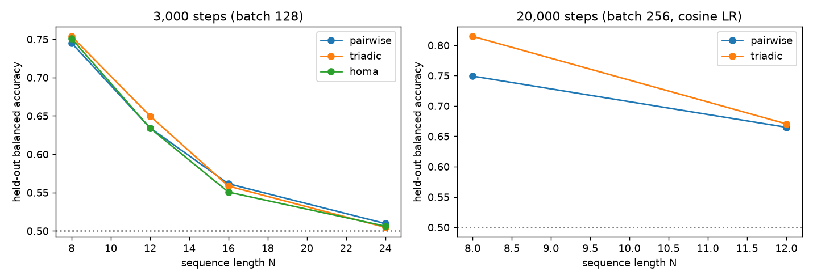

# HOMA / triadic attention on MATCH3 (after Amiraslani & Gao, arXiv:2603.11133)

Task (Sanford et al. 2024 MATCH3): sequence of N integers in Z_M, label y_i = 1 iff there exist positions j,z (any positions, ordered, including i itself) with x_i+x_j+x_z = 0 mod M. We use M = round(1.45 N^2) to keep labels from saturating (M=N gives 97% positives). Positives are still only ~30-34% (collisions), so **plain accuracy has a majority baseline of 1 - pos_rate (0.66-0.70)**; we therefore also report balanced accuracy (chance = 0.50).

Models: embedding + ONE attention layer (residual) + LayerNorm + linear head, no MLP, d_model=64, 4 heads, non-causal, 2 seeds, evaluated on freshly sampled held-out data (2048 sequences; 4096 for the long runs).
- PAIRWISE: softmax(QK^T/sqrt(d))V.
- TRIADIC: S[i,j,z] = sum_c Q_ic K_jc U_zc / sqrt(d), softmax over all (j,z), value V_j (.) V_z. **Full** (no windows/blocks/low-rank U as in the paper's efficiency tricks).
- HOMA-style: both pathways per head, concatenated, fused by a GELU MLP. (Our simplified version: no overlapping blocks, no windows, no low-rank U.)

## Run 1: 3,000 steps, batch 128, lr 2e-3 (mean of 2 seeds; balanced accuracy)
| N | M | majority baseline acc | pairwise | triadic | HOMA-style |
|---|---|---|---|---|---|
| 8  | 93  | 0.66 | 0.745 | 0.754 | 0.751 |
| 12 | 209 | 0.69 | 0.634 | 0.650 | 0.634 |
| 16 | 371 | 0.69 | 0.561 | 0.558 | 0.551 |
| 24 | 835 | 0.70 | 0.510 | 0.505 | 0.506 |

## Run 2: 20,000 steps, batch 256, cosine LR (N in {8,12}; mean of 2 seeds)
| N | pairwise bal-acc (acc) | triadic bal-acc (acc) |
|---|---|---|
| 8  | 0.749 (0.830) | **0.815 (0.874)** |
| 12 | 0.665 (0.791) | 0.671 (0.794) |

## Findings
- At N=8 with enough training the triadic layer is clearly better than pairwise (0.815 vs 0.749 balanced accuracy, consistent across both seeds), in the direction the paper/Sanford et al. predict.
- At N=12 the advantage nearly vanishes (0.671 vs 0.665) and at N>=16 every model is at or near chance within 3,000 steps. **No model solved MATCH3 at this width and budget**, so we do NOT reproduce "a triadic unit solves it with constant dimension" - this only says it was not learned optimisation-wise in our budget; MATCH3 may need more steps, larger lr tuning, or curriculum.
- In Run 1 the HOMA-style fusion is indistinguishable from the better of its two parts; no evidence for fusion benefit here. The paper's clearest HOMA claims concern windows/blocks, parity with k beyond triadic order, and TAPE protein benchmarks, none of which we tested.

## Caveats
- 2 seeds, one hyperparameter setting, label rate ~0.3 not the paper's balanced sampling (so numbers are not comparable to the paper's).
- Simplified HOMA (no blocks/windows/low-rank); no PARITY/MAJORITY tasks, no TAPE.
- Underfitting vs. true inability is not distinguished; final training loss (0.35-0.50) is still high.

## Process note (Hermes)
Hermes (qwen3.8:27b, 63% GPU) produced a 131-line script that crashed with `TypeError: index_put_(): argument 'values' ... must be Tensor, not bool` in its data generator and had not recovered when I stopped it. The reference implementation here was written by hand. The first reference run was noticeably slower while the 27B model was resident (likely CPU contention from its partial offload; not verified).
